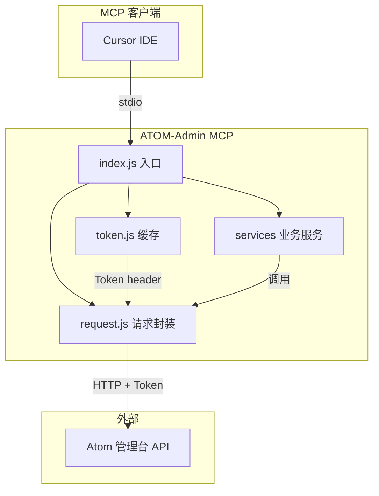

# ATOM-Admin MCP 框架实现计划

## 目标

在 `MCP/ATOM-Admin` 下新建 MCP 服务器，提供 Atom 管理台数据访问能力。先实现基础框架与 14 个工具占位，业务逻辑留空由你后续填充。

## 参考结构

沿用项目内 [MCP/no-fly-zone-pipeline](MCP/no-fly-zone-pipeline/index.js) 的 MCP 实现方式：

- 使用 `@modelcontextprotocol/sdk` 的 `McpServer` + `StdioServerTransport`
- 使用 `zod` 做参数校验
- 通过 `server.tool(name, description, schema, handler)` 注册工具

## 目录结构

```
MCP/ATOM-Admin/
├── package.json
├── index.js              # 入口，注册所有工具
├── config.js             # 配置项（base URL 等）
├── src/
│   ├── token.js          # token 缓存（全局变量）
│   ├── request.js        # 统一请求工具（封装 header、错误处理）
│   └── services/         # 各业务服务（占位）
│       ├── user.js       # 用户、用户组
│       ├── version.js    # iOS/Android/带屏控最低版本
│       ├── aircraft.js   # 飞机型号、固件版本
│       └── noFlyZone.js  # 禁飞区相关
```

## 工具清单与占位设计


| 工具名                               | 描述              | 入参              | 占位返回                    |
| --------------------------------- | --------------- | --------------- | ----------------------- |
| `set_token`                       | 设置并缓存 token     | `token: string` | `{ success: true }`     |
| `get_user_info`                   | 读取用户信息          | 无               | `{ placeholder: true }` |
| `get_user_groups`                 | 获取用户组数据         | 无               | `{ placeholder: true }` |
| `get_ios_min_version`             | 获取 iOS 最低版本     | 无               | `{ placeholder: true }` |
| `get_android_min_version`         | 获取 Android 最低版本 | 无               | `{ placeholder: true }` |
| `get_screen_control_min_version`  | 获取带屏控最低版本       | 无               | `{ placeholder: true }` |
| `get_aircraft_models`             | 获取飞机型号          | 无               | `{ placeholder: true }` |
| `get_aircraft_firmware_version`   | 获取飞行器固件版本       | 无               | `{ placeholder: true }` |
| `query_no_fly_zone_records`       | 查询禁飞区记录         | 可选分页/筛选         | `{ placeholder: true }` |
| `create_no_fly_zone_record`       | 创建禁飞区记录         | 待定              | `{ placeholder: true }` |
| `crawl_no_fly_zone_data`          | 爬取禁飞区数据         | 待定              | `{ placeholder: true }` |
| `package_upload_no_fly_zone_data` | 打包/上传禁飞区数据包     | 待定              | `{ placeholder: true }` |
| `set_no_fly_zone_record_status`  | 设置禁飞区记录启用状态     | `id`, `enabled` | 启用/禁用合并为一个工具      |

## 核心实现要点

### 1. 配置项 (`config.js`)

- **baseUrl**：Atom 管理台 API 的 base URL，作为配置项，可通过环境变量或配置文件设置。

### 2. Token 缓存 (`src/token.js`)

```javascript
// 全局变量存储 token
let cachedToken = null;

export function setToken(token) { cachedToken = token; }
export function getToken() { return cachedToken; }
export function hasToken() { return !!cachedToken; }
```

### 3. 认证方式

- 每个接口请求在 header 中设置：`Token: <token>`（key 为 `Token`，value 为缓存的 token）。
- 通过统一请求工具封装，所有接口调用都走该工具，自动附带 Token。

### 4. 统一请求工具 (`src/request.js`)

封装 `fetch` 或 `axios`，统一处理：

- 拼接 baseUrl + 路径
- 自动在 header 中注入 `Token: getToken()`
- 解析响应格式：`{ code: 0, msg: "success", data: {} }`，成功时返回 `data`
- 错误处理：根据 HTTP 状态码和响应内容判断错误类型，返回给用户：
  - 502：服务未启动
  - 401 / JWT token 错误：认证失败
  - 其他：按 `msg` 或 HTTP 状态描述返回

```javascript
// 伪代码示意
export async function request(path, options = {}) {
  const res = await fetch(`${baseUrl}${path}`, {
    ...options,
    headers: { Token: getToken(), ...options.headers },
  });
  if (res.status === 502) return { error: "服务未启动 (502)" };
  const json = await res.json();
  if (json.code !== 0) return { error: json.msg ?? "请求失败" };
  return { data: json.data };
}
```

**接口响应格式**：`{ code: 0, msg: "success", data: {} }`，`data` 为业务数据。非成功时需根据 `code`、HTTP 状态、JWT 错误等判断类型并返回给用户。

### 5. 工具通用模式

- 除 `set_token` 外，其他工具在占位阶段可先不校验 token，后续实现时再统一加 `hasToken()` 检查。
- 每个 handler 返回 MCP 标准格式：`{ content: [{ type: "text", text: JSON.stringify(result) }] }`。

### 6. 依赖

与 no-fly-zone-pipeline 一致：

```json
"dependencies": {
  "@modelcontextprotocol/sdk": "^1.0.0",
  "zod": "^3.23.0"
}
```

### 7. Cursor 配置

在 Cursor 的 MCP 配置中增加 ATOM-Admin 服务器，例如：

```json
{
  "mcpServers": {
    "atom-admin": {
      "command": "node",
      "args": ["D:/demo/ai-tools/MCP/ATOM-Admin/index.js"]
    }
  }
}
```

（具体路径和配置方式以你本地为准。）

## 数据流示意




## 实施步骤

1. 创建 `MCP/ATOM-Admin` 目录
2. 创建 `package.json`（含依赖与 scripts）
3. 创建 `config.js`（baseUrl 等配置）
4. 创建 `src/token.js`（token 读写）
5. 创建 `src/request.js`（统一请求工具，封装 Token header、错误处理）
6. 创建 `src/services/*.js`（各业务占位函数）
7. 创建 `index.js`（注册 14 个工具并启动 stdio 服务）
8. 执行 `npm install` 验证依赖
9. 在 Cursor 中配置并测试 MCP 连接

## 待你后续补充

- 各接口的具体路径、请求方法、请求体结构
- 分页、筛选等具体参数设计
- 禁飞区爬取、打包、上传的具体流程
